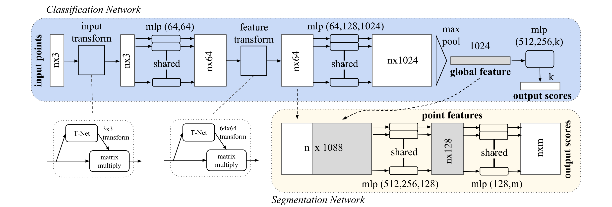

# Paddle-PointNet

_Use PaddlePaddle to implementate PointNet (Classifier Only)_

_Readme is not finished yet ..._

## 1. Introduction

This project reproduces PointNet based on paddlepaddle framework.

**Paper:** [PointNet: Deep Learning on Point Sets for 3D Classification and Segmentation](https://arxiv.org/pdf/1612.00593.pdf)

**Competition Page:** [PaddlePaddle AI Studio](https://aistudio.baidu.com/aistudio/competition/detail/106)

**PointNet Architecture:**


**Other Version Implementation:**

- [TensorFlow (Official)](https://github.com/charlesq34/pointnet)
- [PyTorch](https://github.com/yanx27/Pointnet_Pointnet2_pytorch)

### Metric

- Classification Accuracy 89.2 on ModelNet40 Dataset

## 2. Accuracy

Classification result on ModelNet40

| Model                   | Accuracy |
| ----------------------- | -------- |
| PointNet (Official)     | 89.2     |
| PointNet (PyTorch)      | 90.6     |
| PointNet (PaddlePaddle) | 89.4     |

## 3. Dataset

## 4. Environment

- Hardware: GPU/CPU
- Framework:
  - PaddlePaddle >= 2.1.0

## 5. Quick Start

### Data Preparation

Download [alignment ModelNet](https://shapenet.cs.stanford.edu/media/modelnet40_normal_resampled.zip) and save in `modelnet40_normal_resampled/`. The same dataset as the PyTorch version implementation.

```
wget https://shapenet.cs.stanford.edu/media/modelnet40_normal_resampled.zip
unzip modelnet40_normal_resampled.zip
```

### Train

```
python train.py
```

The model will be saved as `pointnet.pdparams` by default.

### Test

```
python test.py
```

## 6. Details

## 7. Model Information

For other information about the model, please refer to the following table:
| Information       | Description                              |
| ----------------- | ---------------------------------------- |
| Author            | Yunchong Gan                             |
| Date              | 2021.8                                   |
| Framework version | Paddle 2.1.0                             |
| Support hardware  | GPU/CPU                                  |
| Download link     | [pointnet.pdparams](./pointnet.pdparams) |
| Online operation  | Notebook will be avalible soon           |
